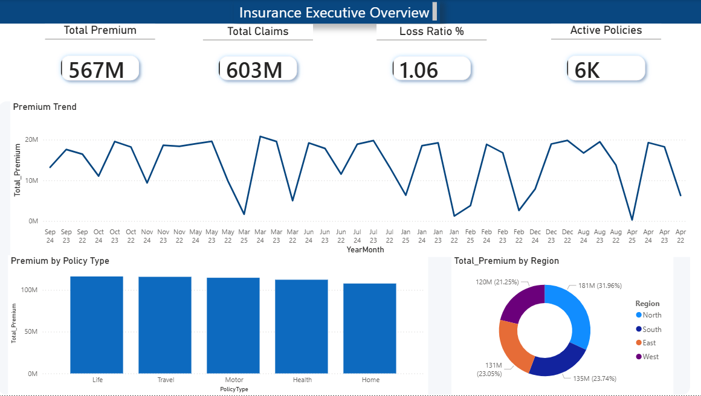
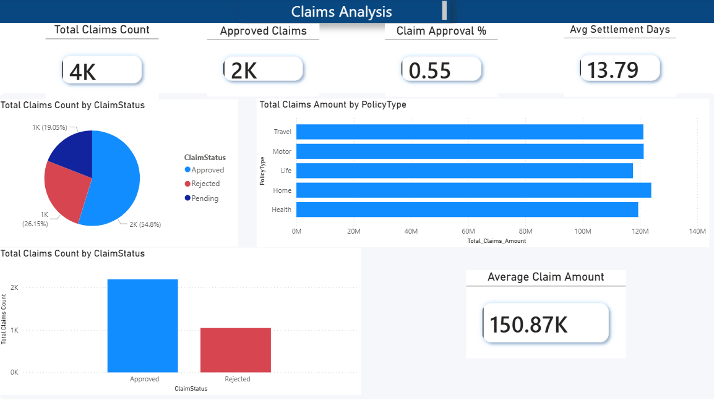
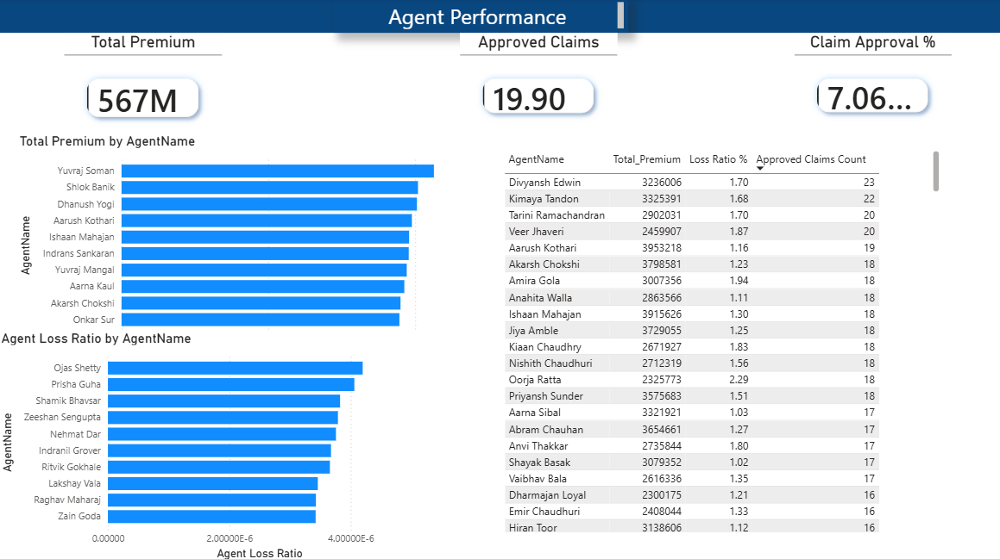
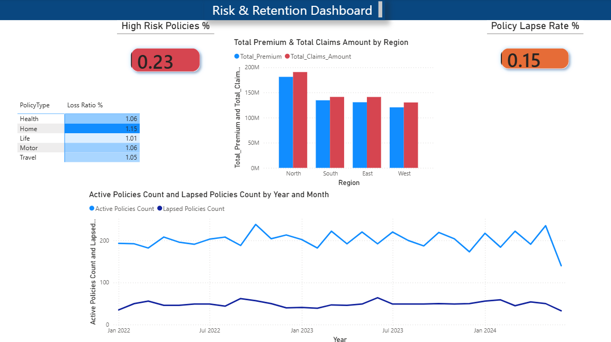

# 📊 Insurance Portfolio Dashboard – Power BI

## 📌 Project Overview

This project is an end-to-end Insurance Analytics Dashboard developed using **Microsoft Power BI** to analyze insurance portfolio performance, claims management, agent performance, and portfolio risk & retention.

The dashboard enables business stakeholders to monitor key insurance KPIs, identify claim trends, evaluate agent performance, and assess risk exposure across different policy categories and regions.

---

## 🎯 Business Problem

Insurance companies manage thousands of policies, claims, agents, and customers.

Without a centralized reporting solution, it becomes difficult to:

- Track premium collections and claims performance.
- Monitor policy growth and active policies.
- Analyze claim approval and settlement efficiency.
- Identify high-risk policy categories.
- Evaluate agent contribution and effectiveness.
- Understand customer retention and policy lapses.

This dashboard provides a single source of truth for decision-making.

---

## 🛠 Tools & Technologies

- Microsoft Power BI Desktop
- DAX (Data Analysis Expressions)
- Power Query
- Excel Dataset
- Data Modeling & Relationships

---

## 📂 Dataset Overview

The project uses an insurance portfolio dataset containing:

### Fact Tables
- Fact_Premiums
- Fact_Claims
- Fact_Policies

### Dimension Tables
- Dim_Customer
- Dim_Agent
- Dim_Policy
- Date Table

### Key Attributes

- Policy Information
- Premium Amount
- Claim Amount
- Claim Status
- Settlement Days
- Customer Details
- Agent Details
- Region
- Policy Type
- Coverage Type

---

# 📈 Dashboard Pages

---

# 1️⃣ Insurance Executive Overview

### Purpose
Provides a high-level summary of overall insurance business performance.

### KPIs

- Total Premium
- Total Claims
- Loss Ratio %
- Active Policies

### Visuals

- Premium Trend Over Time
- Premium by Policy Type
- Premium Distribution by Region

### Business Insights

- Tracks premium collection performance.
- Compares claims against collected premiums.
- Identifies the strongest policy categories.
- Shows premium contribution across regions.

### Screenshot



---

# 2️⃣ Claims Analysis Dashboard

### Purpose

Analyzes claims performance and operational efficiency.

### KPIs

- Total Claims Count
- Approved Claims
- Claim Approval %
- Average Settlement Days
- Average Claim Amount

### Visuals

- Claims Distribution by Status
- Claims Amount by Policy Type
- Approved vs Rejected Claims

### Business Insights

- Measures claim approval effectiveness.
- Tracks settlement efficiency.
- Identifies policy categories generating the highest claims.
- Helps optimize claim processing workflows.

### Screenshot



---

# 3️⃣ Agent Performance Dashboard

### Purpose

Evaluates agent productivity and contribution to business growth.

### KPIs

- Total Premium Generated
- Approved Claims
- Claim Approval %

### Visuals

- Top Agents by Premium
- Agent Loss Ratio Analysis
- Agent Performance Ranking Table

### Business Insights

- Identifies top-performing agents.
- Highlights agents generating maximum premium revenue.
- Measures risk exposure through agent loss ratios.
- Supports performance monitoring and incentive planning.

### Screenshot



---

# 4️⃣ Risk & Retention Dashboard

### Purpose

Analyzes portfolio risk and customer retention behavior.

### KPIs

- High Risk Policies %
- Policy Lapse Rate %

### Visuals

- Premium vs Claims by Region
- Loss Ratio by Policy Type
- Active vs Lapsed Policies Trend

### Business Insights

- Identifies high-risk regions.
- Detects policy categories requiring repricing.
- Tracks policy retention trends.
- Helps monitor customer churn and lapse behavior.

### Screenshot



---

# 📊 Key DAX Measures Created

```DAX
Total_Premium
Total_Claims_Amount
Loss Ratio %
Active_Policies
Total Claims Count
Approved Claims Count
Claim Approval Rate %
Avg Settlement Days
Average Claim Amount
Claims per Agent
Agent Loss Ratio
High Risk Policy %
Policy Lapse Rate %
Active Policies Count
Lapsed Policies Count
```

---

# 📌 Major Insights Generated

### Executive Overview

- Premium collections exceed ₹567M.
- More than 6,000 active policies are currently managed.
- Multiple policy types contribute almost equally to premium revenue.

### Claims Analysis

- Majority of claims are approved.
- Average settlement time is approximately 14 days.
- Travel and Home policies generate significant claim volumes.

### Agent Performance

- Top agents contribute a substantial share of premium revenue.
- Agent-level loss ratio helps identify high-risk portfolios.
- Performance rankings enable better incentive planning.

### Risk & Retention

- Certain regions show higher claims relative to premiums.
- Policy lapse rate highlights customer retention challenges.
- Loss ratio analysis helps identify products requiring pricing adjustments.

---

# 📚 Skills Demonstrated

- Data Cleaning & Transformation
- Data Modeling
- Star Schema Design
- DAX Measure Creation
- KPI Development
- Interactive Dashboard Design
- Business Intelligence Reporting
- Data Visualization Best Practices

---

# 🚀 How to Run

1. Download the `.pbix` file.
2. Open using Microsoft Power BI Desktop.
3. Refresh the dataset if required.
4. Explore all dashboard pages and visual interactions.

---

# 👨‍💻 Author

**Dinesh Paloju**
